### Hi there, I'm Syazwan 
I am a software developer from Malaysia.
<br/>

[](https://github.com/syazwanz/syazwanz/actions/workflows/wakatime.yml)
[](https://github.com/syazwanz/syazwanz/actions/workflows/grs.yml)

📊 **This Week I Spent My Time On:**
<!--START_SECTION:waka-->

```txt
Markdown     9 hrs 2 mins          ██████████░░░░░░░░░░░░░░░   40.05 %
Vue          4 hrs 43 mins         █████▒░░░░░░░░░░░░░░░░░░░   20.97 %
TypeScript   3 hrs 14 mins         ███▓░░░░░░░░░░░░░░░░░░░░░   14.38 %
Other        3 hrs                 ███▒░░░░░░░░░░░░░░░░░░░░░   13.32 %
CSS          1 hr 10 mins          █▒░░░░░░░░░░░░░░░░░░░░░░░   05.23 %
```

<!--END_SECTION:waka-->

📈 **My GitHub Stats:**
<div></div>
<div></div>
<div style="margin-bottom:10px;"></div>
